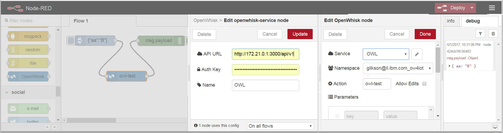

(C) Copyright 2016 IBM Corp.

**OpenWhisk-Light (OWL)** is a lightweight runtime surfacing the standard OpenWhisk API and designed to run OpenWhisk actions on a local Docker engine, typically at the edge of the network (e.g., on IoT gateways), while using a centralized OpenWhisk cloud service as a 'master' repository and catalog of actions.

**NOTICE**: OWL is an early prototype, not suitable for production use.

## Motivation and Approach

OpenWhisk-Light (OWL) serves two main goals:
1. Ability to run OpenWhisk actions in a potentially resource-constrained environment outside of the centralized cloud (e.g., IoT gateways at the edge of the network)
2. Compatibility with OpenWhisk both at the API level (for integration purposes) as well as at the level of individual action containers (for portability and reuse)

The REST API surfaced by OWL is compatible with OpenWhisk API, making it possible to use standard tools like the OpenWhisk CLI, the openwhisk-client-js library, the OpenWhisk action node in Node-RED (which uses the above library), etc.

One of the use-cases behind the design of OWL is edge-to-cloud analytics of IoT data-in-motion, where the data processing pipeline is implemented using OpenWhisk and can seamlessly span the cloud and the edge.

## Architecture


A typical OWL deployment would include the following components:
1. OpenWhisk cloud service (e.g., IBM Bluemix OpenWhisk), hosting the repository and the catalog of actions, as well as the runtime of actions in the cloud
2. Local Docker runtime (e.g., deployed on individual IoT gateways at the edge of the network)
3. A Docker container running OWL, configured to interact with the Docker runtime and with centralized OpenWhisk repository/catalog
4. [optional] A Node-RED runtime, potentially deployed as a Docker container on the same Docker engine, configured with a flow that interacts with the IoT devices/sensors and invokes OpenWhisk action nodes that delegate the processing logic to a local OWL runtime

## Try it out
Build local OWL image:
``` sh
$ docker build -t owl-img --no-cache https://github.com/kpavel/openwhisk-light.git
```
Create and/or identify the Docker network that will be used for communication between OWL and action containers, as well as the address of the Docker host on that network (OWL will use it to access the Docker API):
```
$ docker network create owl-net
$ docker network inspect owl-net
```
Identify the IP of the gateway - e.g., 172.21.0.1. This is the IP you need to specify in 'DOCKER_HOST' below. Verify that the Docker remote API is enabled and accessible:
``` sh
$ docker -H tcp://172.21.0.1:2375 info
```
Verify that the wsk CLI is properly configured (the following command does not return errors):
``` sh
$ wsk property get
```
Run the OWL container:
``` sh
$ docker run -d --net=owl-net -p 3000:3000 -e DOCKER_HOST=tcp://172.21.0.1:2375 --name owl owl-img
```
If this is a consequent creation of OWL container and Docker complains that it already exists, run `docker rm -f owl` first. Verify that OWL started successfully by verifying that there are no errors in logs:
``` sh
$ docker logs owl
```
Pull & tag the base image needed for the action (e.g., nodejs6). This needs to be done only once per base image.
``` sh
$ docker pull openwhisk/nodejs6action -t nodejs6action
```
Create action (optional)
``` sh
$ wsk action create owl-test --kind nodejs:6 openwhisk-light/test/owl-test.js
ok: created action owl-test
```
Invoke the action
``` sh
$ wsk action --apihost http://localhost:3000 invoke owl-test -r -p mykey myval
{
    "mykey": "myval"
}
```
Compare the latency of a local execution and the one in a remote cloud:
``` sh
$ time wsk action --apihost http://localhost:3000 invoke owl-test -r -p mykey myval
{
    "mykey": "myval"
}
real	0m0.045s
user	0m0.020s
sys	0m0.012s
$ time wsk action invoke owl-test -r -p mykey myval
{
    "mykey": "myval"
}
real	0m0.842s
user	0m0.104s
sys	0m0.024s
```
Notice that the "real" time in the local invocation is shorter by a factor of 15-20 compared to the one sending the invocation to the cloud.

[Optional] Use OWL endpoint in configuration of OpenWhisk action nodes in Node-RED flows (e.g., when Node-RED is running in a Docker container on the same host), e.g.:


## OpenWhisk API support

Most of the OpenWhisk REST API calls supported by OWL are simply forwarded "as is" to the centralized OpenWhisk service in the cloud. In fact, this is the default behavior, unless there is an explicit implementation overriding a certain http route in [routes.js](routes.js)  - which currently includes the following operations:
- invoke action: invoke a given action locally (see below).
- get action: in addition to retrieving action metadata and code from the centralized OpenWhisk catalog, keep it in the local in-memory cache of OWL
- delete action: in addition to deleting a given action from the centralized catalog, clean it up from the OWL in-memory cache of actions metadata
- activations: show activations records for local action invocations (kept in a local PouchDB)

## Action invocation flow
The main API which is implemented locally in OWL is the API to invoke an action. In a nutshell, the invocation logic involves the following steps:
1. Check whether a given action is known locally. If not, retrieve action details (metadata and code) from the centralized OpenWhisk.
2. Check whether there are running containers with the given action which are currently idle (i.e., not processing any payload). If not, attempt creating a new container from the image associated with the action, and initializing the action container with the action code (using the `/init` REST API of action containers).
3. Invoke the action by calling the `/run` REST API of the action container, passing the JSON payload to the container and passing the result back.

## Resource management
Similarly to centralized OpenWhisk in the cloud, OWL attempts to minimize the latency of consequent invocations of the same action by keeping 'hot' action containers preloaded with the proper action container image and code, and ready to process the next invocation payload. However, in order not to run out of capacity too quickly, there is a need to balance availability of 'hot' containers for a certain action with avavilability of resources to create containers for other actions. This balance is currently managed by a simple "preemption" mechanism, monitoring the resource utilization and the idleness of containers, and cleaning up idle containers when needed. The logic is controlled by several configuration parameters (specified in [config.js](config.js)), including:
- preemptionPeriod: how often (in seconds) to invoke the preemption logic
- totalCapacity: total number of containers allowed to run on a single Docker host simultaneously
- preemption_high_percent: high watermark, indicating above which percent of totalCapacity we should start cleaning up idle containers
- preemption_low_percent: low watermark, indicating below which percent of totalCapacity we should reach in order to stop cleaning up idle containers.

For example, if totalCapacity is 8 and watermarks are 70% and 40%, cleanup of idle containers will start when there are 6 containers running (above 8\*70%=5.6), and will stop once the number of running containers decreases to 3 (below 8\*40%=3.2). Cleanup applies to containers with longest idle time first.


## Extensions and future work

OWL is designed to address several additional non-functional requirements (some of which are currently work-in-progress), including:
1. Enable local execution on a cluster of hosts. This is already supported with Docker Swarm, taking advantage of its compatibility with the remote Docker API. However, such configuration is currently not optimized to ensure locality between the placement of the action container and the location of the data source (e.g., in cases when there is a desire to pool gateways together, offloading computation between them when necessary).
2. Enable running OpenWhisk actions on different kinds of hardware architecture, such as ARM-based hardware (e.g., Raspberry Pi). OWL currently assumes that 'base' Docker images used for the 'native' action types (node.js, python, Java, etc) are pre-deployed on each Docker engine. These images can be adjusted to fit the hardware architecture. For 'blackbox' actions, supporting cross-arch portability would require maintaining images built for the different kinds of architecture, and introducing a naming convention to select the proper one when the image is pulled.
3. Enable (limited) disconnected operation, when centralized OpenWhisk repository/catalog is not accessible (e.g., in mobile deployments with intermittent connectivity)
4. Enable multi-tier deployment with "bursting" between tiers when running out of local capacity and there are no idle containers (e.g., individual gateway --> small local cluster --> cloud). An experimental version of this capability is already supported by configuring the 'delegate_on_failure' property to 'true' with small number of retries (on failure 0 would cause immediate delegation to the remote OpenWhisk).


## License
[Apache 2.0](LICENSE.txt)
